# 如何使用 Galaxybase 图数据库

## 什么是Galaxybase？

Galaxybase作为第三代图数据库技术的代表产品，是国内首个成熟、通用、全自主知识产权的商业化图数据库。得益于底层自研数据存储和分布式并行处理架构，解决了大规模关联数据高效存储、查询、计算的难题，较现存同类技术有百倍性能提升，为企业打通数据孤岛、建立以推理为基础的人工智能，提供了从数据迁移、数据建模、数据存储、数据查询、数据运算到数据分析的一站式解决方案。

Galaxybase-Standalone（简称 Galaxybase-S）是Galaxybase的单机版，提供了单机环境下的多种功能。Galaxybase-S免费版限制存储容量，仅供非商业性质的学习使用。也可购买Galaxybase-S付费授权解除存储容量上限。

Galaxybase-S对基础性能设定了一些限制，若想获得Galaxybase的完整性能，请登录[Galaxybase官网](https://www.galaxybase.com) 并联系官方客服。

## 如何使用

Galaxybase-S 的使用详见 [Galaxybase-S 官网文档](https://www.galaxybase.com/document?file=v3.4.1%2Fstandalone-doc)，本文仅介绍如何下载、部署、启动 Galaxybase-S 的服务、导入数据、连接 G6VP。

### 1.下载 Galaxybase-S 包

打开 [Galaxybase官网](https://www.galaxybase.com/) 后登录账号，如没有账号则先注册账号，登录完成后，点击 `下载试用` 按钮， 如下图所示：
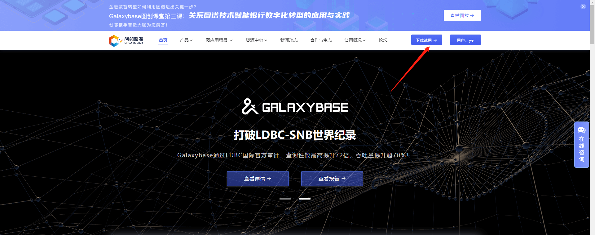
这时候会来到下载页面，可以根据自己的需求选择对应的版本，我们这里下载的是单机免费版，点击立即下载即可：
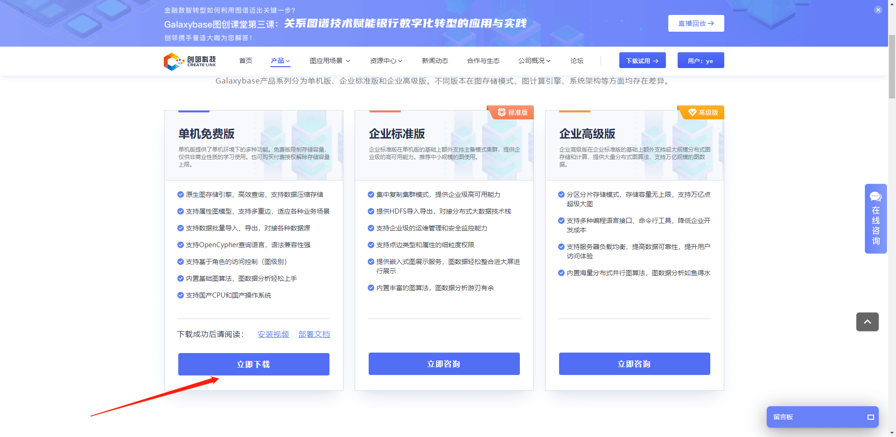
这时候会得到一个 `galaxybase-standalone.tar.gz` 包。

### 2. 部署、启动 Galaxybase-S 包

关于部署、启动可以参考 [Galaxybase-S 安装视频](https://www.bilibili.com/video/BV1iY4y1F7Hn/) 或 [Galaxybase-S 部署文档](https://www.galaxybase.com/document?file=v3.4.1%2Fstandalone-doc&docid=26)，这两份资料都有非常详细的部署教程。

### 3. 导入数据

启动好图服务之后，首先需点击下载 [模型文件、映射文件、数据文件](https://galaxybase.com/public/download/MovieDemo.zip)，下载完成后，我们把该文件解压，将里面的内容放到docker包解压后的文件下，路径如：`/root/galaxybase-20220721170804/bin/home/graph/data`，
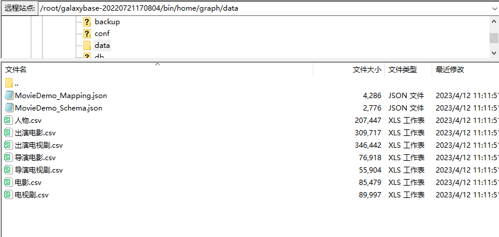
放置好文件后，我们回到控制台中，首先cd到`/root/galaxybase-20220721170804/bin`目录下，
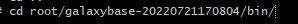

接着需要用到galaxybase-load工具进行加载图，输入以下命令：

```
./galaxybase-load -g MovieDemo -s home/graph/data/MovieDemo_Schema.json -m home/graph/data/MovieDemo_Mapping.json --disableStudio
```

galaxybase-load工具使用可参考 [Galaxybase图构建数据导入工具文档](https://galaxybase.com/document?file=v3.4.1%2Fstandalone-doc&docid=76)。

加载完成后如下图所示：
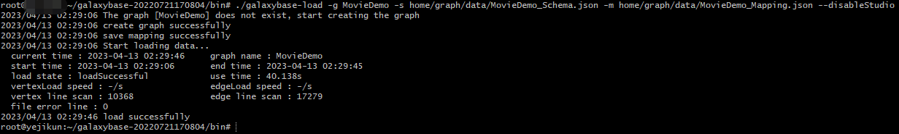


### 4. 启动 G6VP 服务

克隆 G6VP 代码：

```
git clone https://github.com/antvis/G6VP.git
```

安装依赖：

```
pnpm install
```

启动站点
```
npm run start
```

### 5. 连接 G6VP

G6VP 服务启动成功后，打开地址 [http://localhost:8000](http://localhost:8000)，在表单中填写下面信息：

- 平台地址：即 Galaxybase 的图服务地址，默认端口为18088，若服务器地址为：192.168.1.1，则该地址为：`http://192.168.1.1:18088`
- 账号：即 Galaxybase 图数据库的账号，默认为admin
- 密码：即 Galaxybase 图数据库的密码，默认为admin


点击「开始连接」，若成功连接，右上方将出现下图提示，下方将出现「选择子图」 panel：

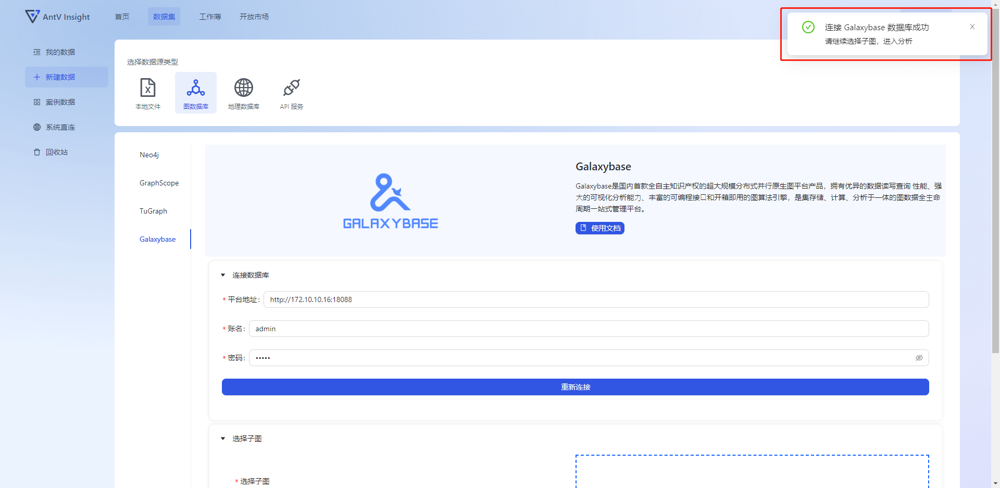

「选择子图」的下拉框中列举了该 Galaxybase 服务中的所有图名称，选择其中一个，然后在「数据名称」中为当前创建的 G6VP 数据集起一个名字，下图例子中起名为“galaxybase-dataset1”：

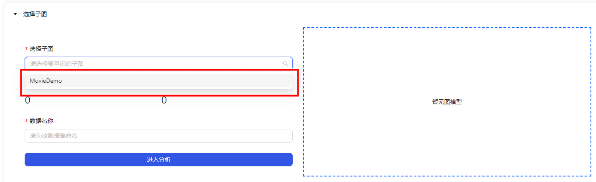
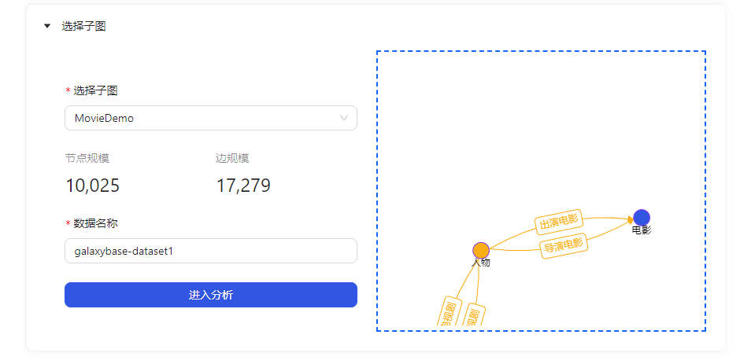

再点击「进入分析」，即可创建数据集成功，页面将跳转到「数据集」模块，您将在数据集列表中看到刚刚创建的名为“galaxybase-dataset1” G6VP 数据集：

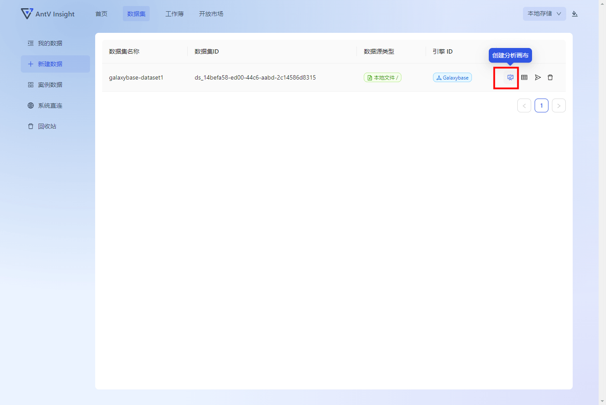

点击操作中的创建画布icon按钮，即使用该数据集创建工作簿，此时，页面跳转到新建工作簿页面，数据集和模版已为您填充好，在「工作簿名称」输入框为该该工作簿起一个名称，然后点击「创建画布」，即可进入工作簿。

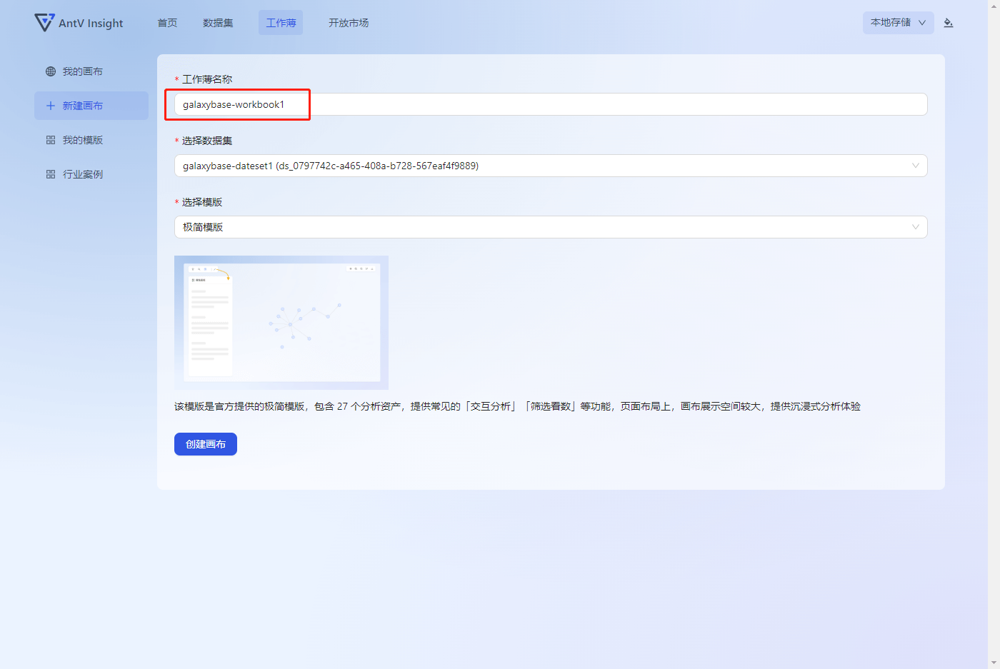

点击「创建画布」后：

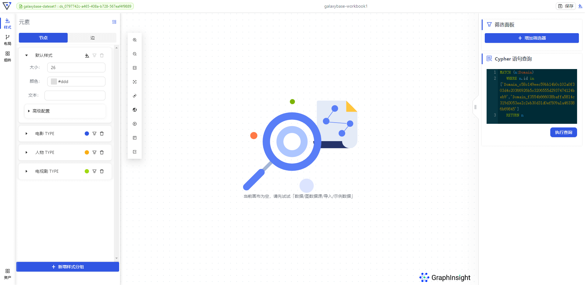

### 6. 分析数据

此时，您已经完成了 Galaxybase 数据库的连接和数据、工作簿的创建，可以在刚刚新建的工作簿中进行数据分析了。在右侧可以看到Cypher语句查询模块，输入 Cypher 查询语句，例如下图中的 `MATCH (n) RETURN n LIMIT 10`，可以成功查询到十个节点：

这时候可以通过左侧的样式面板来对图上的节点进行修改。

单击一个节点，可查询其详情，并显示在属性面板中：
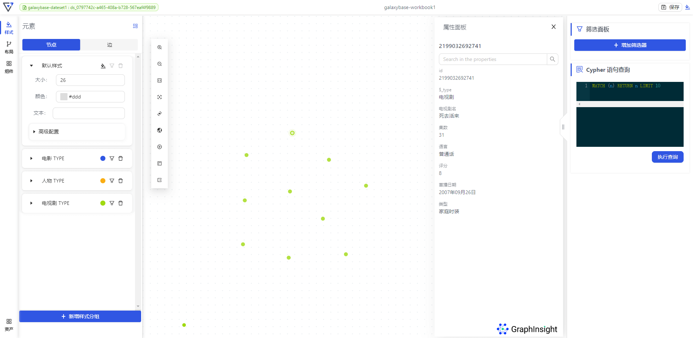

选择一个或多个节点，在节点的右键菜单中，选择「一度扩展」，进行该节点的邻居查询：


扩展结果：

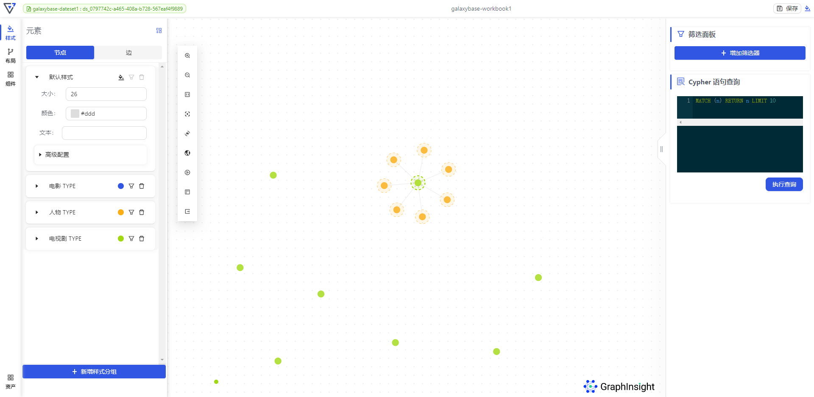