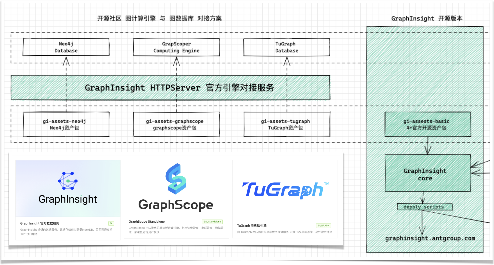

## 定义

GISDK 是构建 G6VP 产品的技术底座，它由 Graphin 组件封装而成，旨在通过一份配置文件，渲染出一个图分析应用。

## 使用场景

当用户在 G6VP 产品上完成图数据的可视化与分析，希望进一步集成到自己的业务系统中，就需要使用产品提供的「导出 SDK」功能。

该功能会将整个画布的参数导出成一份 JSON 文件 `GI_EXPORT_FILES`，然后通过 `@antv/gi-sdk` 提供的 GISDK 组件，以 React 组件的形式原生运行。

```jsx | pure
import GISDK from '@antv/gi-sdk';
//从 GI 站点上导出的配置
import { assets, config, services } from './GI_EXPORT_FILES';

const GraphApp = () => {
  return <GISDK id="my-graph-app" assets={assets} config={config} services={services} />;
};

export default GraphApp;
```

我们可以看出，GISDK 仅接受 4 个参数

| Prop Name  | Type       | Description                                  | Required |
| ---------- | ---------- | -------------------------------------------- | -------- |
| `id`       | `string`   | 唯一标识：用于管理多实例。                   | Yes      |
| `config`   | `GIConfig` | 配置表：定义节点、边和组件的具体属性。       | Yes      |
| `assets`   | `GIAssets` | 资产池：包含节点、边、布局和组件的定义。     | Yes      |
| `services` | `Array`    | 服务池：定义了数据获取和其他交互逻辑的函数。 | Yes      |

下面，我们将脱离 G6VP 产品，完全构造一个符合上述组件规范的 GISDK DEMO

## DEMO

<code src='./demos/gi-sdk.tsx'>

## 代码解析

在上述的案例中，我们将整个图分析应用划分成 3 部分

- assets：资产池，集合了应用渲染所需的 React 组件
- config：配置表：每个资产配置的集合，id 用来匹配组件，props 用于运行时参数
- services：数据池：组件需要数据获取或者其他数据交互

## Assets 资产池！一切都是组件！

如上述案例所示，assets 的数据结构定义如下，这恰好对应了 assets 的三种类型

```jsx | pure
const assets = {
  components, //分析资产
  elements, //元素资产
  layouts, //元素资产
};
```

我们先重点来看 `assets.components` ，以计数器资产为例，是由 `info` `registerMeta` 和 `component` 三部分组成的。

```jsx | pure
const CounterAsset = {
  component: Counter,
  info: {
    name: '计数器',
    id: 'Counter',
    type: 'AUTO',
    category: 'workbook',
  },
  registerMeta: () => ({}),
};
```

- `component` 是普通的 React 组件，组件内可以通过 `@antv/gi-sdk` 提供的 `useContext`方法，获得 GISDK 提供的全局状态
- `registerMeta` 用于 `component` 组件属性 props 的可视化表达， 采用 [Formily](https://www.yuque.com/r/goto?url=https%3A%2F%2Fantd.formilyjs.org%2Fzh-CN%2Fcomponents) 表单库。
- `info` 是元信息，用于组件的更多信息描述，可以用于 G6VP 站点的上层消费

| 属性            | 类型            | 描述       |
| --------------- | --------------- | ---------- |
| `id`            | `string`        | 资产 ID    |
| `name`          | `string`        | 资产名称   |
| `cover`         | `string`        | 资产缩略图 |
| `type`          | `AssetType`     | 资产类型   |
| `icon`          | `string`        | 资产 ID    |
| `category`      | `AssetCategory` | 资产分类   |
| `desc`          | `string`        | 资产描述   |
| `[key: string]` | `any`           | 额外的属性 |

整个 info 元信息中，`id` 和 `type` 是必选的， `id` 默认需要「组件名」「组件文件夹名」保持一致，`type` 决定了资产的运行时渲染逻辑

| AssetType      | 名称             | 描述                                                                               |
| -------------- | ---------------- | ---------------------------------------------------------------------------------- |
| `AUTO`         | 自加载组件       | 拥有独立的 UI 和交互，例如 CanvasSetting                                           |
| `INITIALIZER`  | 初始化组件       | 全局唯一，用于初始化 例如 Initializer                                              |
| `GICC_LAYOUT`  | 布局容器组件     | 全局唯一，用于页面布局 例如 SegmentContainer                                       |
| `GIAC`         | 原子组件         | 没有自己的 UI 和交互，都是由容器组件决定的，例如 ZoomIn                            |
| `GIAC_CONTENT` | 原子组件（内容） | 有自己的 UI 和交互，但是不能决定自己展示在什么位置，什么时候触发，例如 FilterPanel |
| `GIAC_MENU`    | 原子组件（菜单） | 和 GIAC_CONTENT 类似，但是只能集成在 Menu 容器中 ，例如 RemoveNodeWithMenu         |
| `GICC`         | 容器组件         | 提供了容器功能，可以集成 GIAC_CONTENT 也可以集成 GIAC 原子资产。例如 Toolbar       |
| `GICC_MENU`    | 容器组件（菜单） | 提供了容器功能，可以集成 GIAC_MENU 原子资产。 例如 ContextMenu                     |
| `NODE`         | 节点组件         |                                                                                    |
| `EDGE`         | 边组件           |                                                                                    |
| `LAYOUT`       | 布局算法         |                                                                                    |

## Config 配置表！id 用来匹配组件，props 用于运行时参数

`config` 配置表的结构基本上都是`{id:"",props:{}}`，其核心是 SDK 运行时， `id` 用于从资产池中找寻需要运行的资产实例，`props`用于给组件外部传参，（因此 layout 和 pageLayout 其实设计得不是很合理，至少来说是不太一致，后续需要修改）

```jsx | pure
const config = {
  nodes: [{ id: 'SimpleNode', props: {} }],
  edges: [{ id: 'SimpleEdge', props: {} }],
  components: [
    { id: 'Counter', props: {} },
    { id: 'Initializer', props: {} },
  ],
  layout: {
    id: 'Force',
    props: {},
  },
  pageLayout: {},
};
```

| 属性         | 类型                       | 描述             |
| ------------ | -------------------------- | ---------------- |
| `layout`     | `GILayoutConfig`           | 图的布局配置     |
| `components` | `Array<GIComponentConfig>` | 组件配置数组     |
| `nodes`      | `Array<GINodeConfig>`      | 节点配置数组     |
| `edges`      | `Array<GIEdgeConfig>`      | 边配置数组       |
| `pageLayout` | `GIComponentConfig`        | 页面布局组件配置 |

| GIComponentConfig | 类型        | 描述               |
| ----------------- | ----------- | ------------------ |
| `id`              | `string`    | 组件配置的唯一标识 |
| `name`            | `string`    | 组件的名称，可选   |
| `type`            | `AssetType` | 资产类型           |
| `props`           | `Object`    | 组件的属性配置     |

对于节点和边这类元素资产，我们在`id`和`props`的基础上，增加了`expressions`和`logic`两个关键字段，用于条件渲染，如下述代码所示，`nodes[1]`的逻辑将会先执行,当`id eql account_7 ` 时候，将执行配置`nodes[1].props`

```jsx | pure

 const nodes= [
    {
      id: 'SimpleNode',
      props: {
        size: 26,
        color: 'red',
        label: [],
      },
      name: '官方节点',
      expressions: [],
      logic: true,
      groupName: '默认样式',
    },
    {
      id: 'SimpleNode',
      expressions: [
        {
          name: 'id',
          operator: 'eql',
          value: 'account_7',
        },
      ],
      props: {
        size: 26,
        color: '#3056E3',
        label: ['id'],
      },
      name: '官方节点',
      logic: true,
      groupName: 'Account_7 TYPE',
    },
  ],

```

| GINodeConfig / GIEdgeConfig | 类型      | 描述                     |
| --------------------------- | --------- | ------------------------ |
| `id`                        | `string`  | 节点配置的唯一标识       |
| `name`                      | `string`  | 节点的名称，可选         |
| `props`                     | `Object`  | 节点的属性配置           |
| `expressions`               | `Array`   | 表达式数组，用于条件渲染 |
| `logic`                     | `boolean` | 逻辑标识                 |
| `groupName`                 | `string`  | 分组名称                 |
| `default`                   | `boolean` | 是否为默认设置           |

## Services 服务池！接口别写死，从服务池中匹配捞数据

以上述代码的 `Initializer` 初始化器为例，在组件的运行中，需要查询初始图数据和图模型数据。 对于不同的数据源，比如图数据库，图计算引擎，设置是本地 CSV 文件，数据查询的方式可能不一样，通常做法，我们会这么做

```jsx | pure
<Initializer data={data} schemaData={schemaData} />
```

GI 的设计是这样的,组件的 `props` 设计仅用于静态数据配置，它由 `registerMeta` 产生。对于用户交互，系统交互产生的动态数据，则需要在封装在组件内部，对外仅暴露服务 ID，这样既可以形成接口规范，也有利于服务实现的复写，这对于多引擎的场景下，非常有帮助。如下图所示，不同数据引擎封装了一组资产定义的服务接口，就能够轻松对接上



```jsx | pure

const services: GIService[] = [
  {
    name: '初始化查询',
    method: 'GET',
    id: 'GI/GI_SERVICE_INTIAL_GRAPH',
    service: async () => {
      return new Promise(resolve => {
        resolve(data);
      });
    },
  },
  {
    name: '查询图模型',
    method: 'GET',
    id: 'GI/GI_SERVICE_SCHEMA',
    service: async () => {
      return new Promise(resolve => {
        resolve(schemaData);
      });
    },
  },
];

const Initializer = props => {
  const { services, updateContext } = useContext();
  const { serviceId, schemaServiceId } = props;
  useEffect(() => {
    let initialService = services.find(s => s.id === serviceId) as GIService;
    let schemaService = services.find(s => s.id === schemaServiceId) as GIService;

    Promise.all([schemaService.service(), initialService.service()]).then(([schemaData, graphData]) => {
      console.log('Initializer', Initializer);
      updateContext(draft => {
        draft.data = graphData;
        draft.schemaData = schemaData;
        draft.initialized = true;
      });
    });
  }, []);
  return null;
};


```
